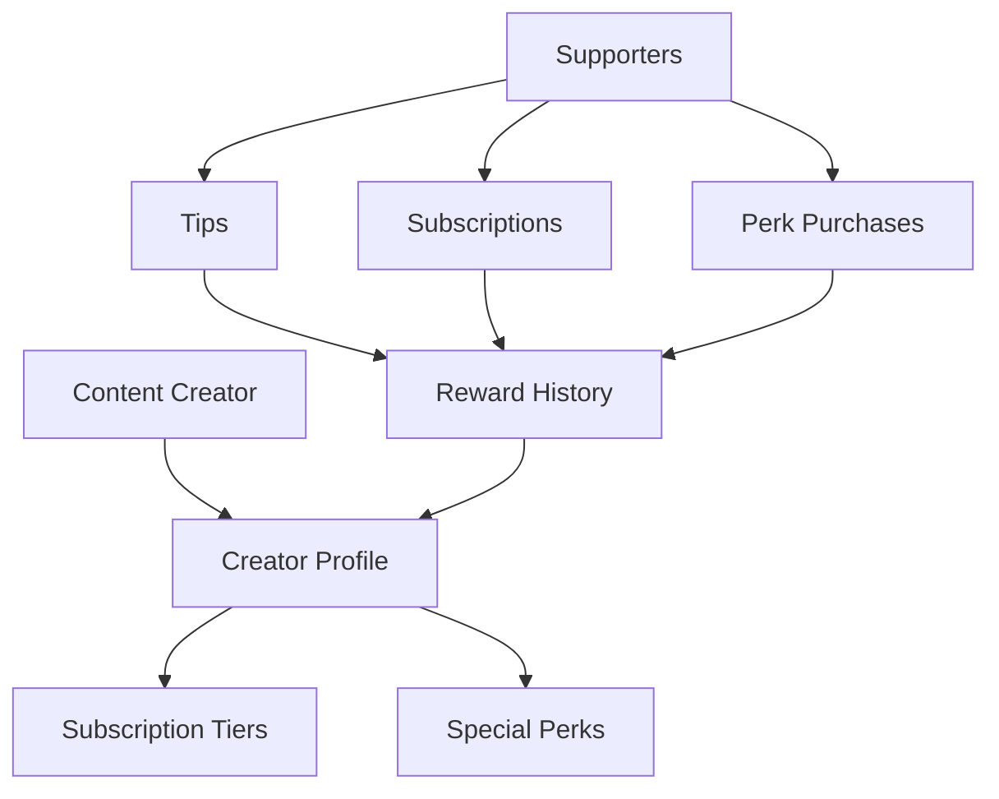

# CoinVine Creator Rewards

A decentralized platform enabling direct cryptocurrency rewards from fans to content creators, eliminating traditional platform fees and intermediaries.

## Overview

CoinVine creates a transparent and efficient ecosystem where content creators can receive direct support from their community through:

- One-time tips
- Subscription-based support
- Special perks and rewards
- Transparent reward history
- Verifiable creator profiles

The platform maintains minimal fees and gives creators full ownership of their profile data and reward history.

## Architecture

CoinVine uses a single core smart contract to manage all platform functionality, implementing a clean and modular design.



### Core Components

1. **Creator Profiles**: Managed identities for content creators
2. **Reward Mechanisms**: Tips, subscriptions, and perks
3. **Subscription System**: Tiered support levels with auto-renewal
4. **Perks Management**: Limited or unlimited special offers
5. **Reward Tracking**: Transparent history of all transactions

## Contract Documentation

### CoinVine Core Contract

The main contract managing all platform functionality.

#### Key Features

- Creator profile registration and management
- Subscription tier creation and management
- Direct tipping system
- Special perks system
- Transparent reward history
- Platform fee handling

#### Access Control

- Creator-specific functions restricted to profile owners
- Platform management functions restricted to platform wallet
- Public functions available to all users

## Getting Started

### Prerequisites

- Clarinet
- Stacks wallet
- STX tokens for transactions

### Basic Usage

1. Register as a creator:
```clarity
(contract-call? .coinvine-core register-creator "Creator Name" "Description" "content-url")
```

2. Send a tip:
```clarity
(contract-call? .coinvine-core tip-creator creator-id amount message anonymous)
```

3. Subscribe to a creator:
```clarity
(contract-call? .coinvine-core subscribe creator-id tier-id auto-renew message anonymous)
```

## Function Reference

### Creator Management

```clarity
(register-creator (name (string-ascii 64)) (description (string-utf8 500)) (content-url (string-utf8 256)))
(update-creator-profile (creator-id uint) (name (string-ascii 64)) (description (string-utf8 500)) (content-url (string-utf8 256)))
```

### Reward Functions

```clarity
(tip-creator (creator-id uint) (amount uint) (message (optional (string-utf8 280))) (anonymous bool))
(subscribe (creator-id uint) (tier-id uint) (auto-renew bool) (message (optional (string-utf8 280))) (anonymous bool))
(purchase-perk (creator-id uint) (perk-id uint) (message (optional (string-utf8 280))) (anonymous bool))
```

### Subscription Management

```clarity
(add-subscription-tier (creator-id uint) (tier-id uint) (name (string-ascii 64)) (price uint) (duration-days uint) (description (string-utf8 500)))
(cancel-subscription (creator-id uint))
```

### Perk Management

```clarity
(add-perk (creator-id uint) (name (string-ascii 64)) (price uint) (description (string-utf8 500)) (available-count (optional uint)))
```

## Development

### Testing

1. Clone the repository
2. Install Clarinet
3. Run tests:
```bash
clarinet test
```

### Local Development

1. Start Clarinet console:
```bash
clarinet console
```

2. Deploy contracts:
```bash
clarinet deploy
```

## Security Considerations

### Platform Fees
- Maximum platform fee capped at 30%
- Fee changes restricted to platform wallet
- Transparent fee calculation and distribution

### Access Control
- Creator profile functions restricted to owners
- Platform management restricted to platform wallet
- Subscription and perk validity checks

### Transaction Safety
- Minimum tip amount enforced
- Subscription duration validation
- Perk availability checking
- Built-in fund transfer security

### Limitations
- No refund mechanism for subscriptions
- Platform fee changes affect all future transactions
- Creator verification centralized through platform wallet